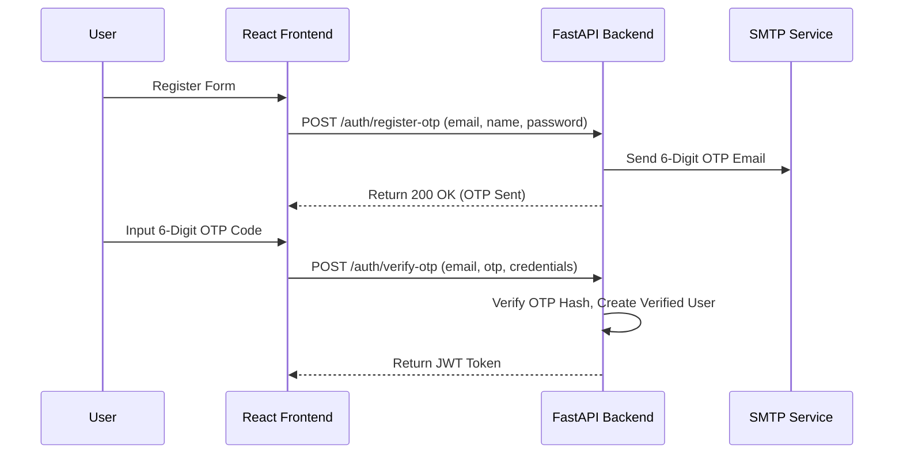

# IntelliCart — Developer Manual

This document outlines the system architecture, file structure, database schemes, core business logic, and UI/UX flows for the IntelliCart full-stack application.

---

## 1. Overview
- **Purpose:** Premium e-commerce application demo with a FastAPI backend and a React + Vite frontend.
- **Backend Base URL:** `http://localhost:8000/api/v1`
- **Frontend Dev URL:** `http://localhost:5173`
- **Containerized Dev:** `docker compose up --build` launches the application and a MongoDB database.

---

## 2. Directory Structure & Key Files

### Backend Structure
- **Entrypoint:** [main.py](file:///c:/Users/harir/OneDrive/Desktop/IntelliCart/backend/app/main.py) — Registers app lifespan, CORS configurations, mounts `/uploads` directory, and defines routers.
- **Config:** [config.py](file:///c:/Users/harir/OneDrive/Desktop/IntelliCart/backend/app/core/config.py) — Handles `.env` variables, including SMTP settings and JWT secrets.
- **Security:** [security.py](file:///c:/Users/harir/OneDrive/Desktop/IntelliCart/backend/app/core/security.py) — Utilities for password hashing and JWT token creation/verification.
- **Database Connection & Migrations:** [database.py](file:///c:/Users/harir/OneDrive/Desktop/IntelliCart/backend/app/db/database.py) — Motor + Beanie initialization. Seeds default admin user and backfills product databases (MRP, ratings, reviews, seller details).
- **Models (ODM):** Located in `app/models/`
  - [user_model.py](file:///c:/Users/harir/OneDrive/Desktop/IntelliCart/backend/app/models/user_model.py) — Schema for profiles, roles, and saved shipping addresses.
  - [product_model.py](file:///c:/Users/harir/OneDrive/Desktop/IntelliCart/backend/app/models/product_model.py) — Fields for price, MRP, seller info, stock, and average rating aggregates.
  - [otp_model.py](file:///c:/Users/harir/OneDrive/Desktop/IntelliCart/backend/app/models/otp_model.py) — Store for temporary OTP hashes and expiry timers.
  - [review_model.py](file:///c:/Users/harir/OneDrive/Desktop/IntelliCart/backend/app/models/review_model.py) — User reviews, comments, and star ratings.
  - [order_model.py](file:///c:/Users/harir/OneDrive/Desktop/IntelliCart/backend/app/models/order_model.py), [cart_model.py](file:///c:/Users/harir/OneDrive/Desktop/IntelliCart/backend/app/models/cart_model.py) — Collections for carts and transactional orders.
- **Services (Business Logic):** Located in `app/services/`
  - [auth_service.py](file:///c:/Users/harir/OneDrive/Desktop/IntelliCart/backend/app/services/auth_service.py) — Handles login validation.
  - [otp_service.py](file:///c:/Users/harir/OneDrive/Desktop/IntelliCart/backend/app/services/otp_service.py) — Sends and verifies OTPs for registration.
  - [password_reset_service.py](file:///c:/Users/harir/OneDrive/Desktop/IntelliCart/backend/app/services/password_reset_service.py) — Manages forgot/reset password flows.
  - [user_service.py](file:///c:/Users/harir/OneDrive/Desktop/IntelliCart/backend/app/services/user_service.py) — Address and profile CRUD.
  - [product_service.py](file:///c:/Users/harir/OneDrive/Desktop/IntelliCart/backend/app/services/product_service.py) — Catalog listings, image uploads, cascades, reviews, and delivery estimations.
  - [cart_service.py](file:///c:/Users/harir/OneDrive/Desktop/IntelliCart/backend/app/services/cart_service.py) — Increments quantities and checks item stock.
  - [order_service.py](file:///c:/Users/harir/OneDrive/Desktop/IntelliCart/backend/app/services/order_service.py) — Checkout processes, stock validation/rollback, cancellations, and status logs.
- **Email Utils:** [email.py](file:///c:/Users/harir/OneDrive/Desktop/IntelliCart/backend/app/utils/email.py) — Standard library for sending styled HTML emails (Verification OTPs, password reset codes, invoice receipts, and logistics shipping alerts).

### Frontend Structure
- **Axios Client:** [axios.js](file:///c:/Users/harir/OneDrive/Desktop/IntelliCart/frontend/src/api/axios.js) — Injects authentication token headers and interceptors to broadcast `auth:token-expired` events on 401 errors.
- **Context API:** [AuthContext.jsx](file:///c:/Users/harir/OneDrive/Desktop/IntelliCart/frontend/src/context/AuthContext.jsx) — Listens for Axios token expiry events to logout expired users and toast alerts.
- **Route Protectors:** 
  - [ProtectedRoute.jsx](file:///c:/Users/harir/OneDrive/Desktop/IntelliCart/frontend/src/components/ProtectedRoute.jsx) — Demands standard user authentication.
  - [AdminRoute.jsx](file:///c:/Users/harir/OneDrive/Desktop/IntelliCart/frontend/src/components/AdminRoute.jsx) — Limits access to role="admin" accounts.
  - [NonAdminRoute.jsx](file:///c:/Users/harir/OneDrive/Desktop/IntelliCart/frontend/src/components/NonAdminRoute.jsx) — Redirects logged-in admins to `/admin` to prevent cart/checkout conflicts.
- **Custom UI Inputs:** [OTPInput.jsx](file:///c:/Users/harir/OneDrive/Desktop/IntelliCart/frontend/src/components/ui/OTPInput.jsx) — Multi-box UI input block for digit-based codes.
- **Pages & Control Panels:** Located in `frontend/src/pages/`
  - [Home.jsx](file:///c:/Users/harir/OneDrive/Desktop/IntelliCart/frontend/src/pages/Home.jsx) — Marketing slider, catalog searches, and product features.
  - [Products.jsx](file:///c:/Users/harir/OneDrive/Desktop/IntelliCart/frontend/src/pages/Products.jsx) — Product grid with paginated filtering options.
  - [ProductDetail.jsx](file:///c:/Users/harir/OneDrive/Desktop/IntelliCart/frontend/src/pages/ProductDetail.jsx) — Multi-image product detail view, similar items, and product reviews.
  - [ForgotPassword.jsx](file:///c:/Users/harir/OneDrive/Desktop/IntelliCart/frontend/src/pages/ForgotPassword.jsx) — Verification UI for password recovery.
  - [Profile.jsx](file:///c:/Users/harir/OneDrive/Desktop/IntelliCart/frontend/src/pages/Profile.jsx) — Profile details, password resets, and user address CRUD.
  - [Checkout.jsx](file:///c:/Users/harir/OneDrive/Desktop/IntelliCart/frontend/src/pages/Checkout.jsx) — Address selectors, discount coupons, order summary, and dummy payment forms.
  - [AdminDashboard.jsx](file:///c:/Users/harir/OneDrive/Desktop/IntelliCart/frontend/src/pages/AdminDashboard.jsx) — Complete administrative interface.

---

## 3. Core Business Logic & API Flows

### A. Authentication & OTP Verification

### B. Forgot & Reset Password
1. User enters their email on `/forgot-password`.
2. Backend validates that the email exists, hashes a new 6-digit random code in the `OTP` collection, and sends an email.
3. User enters the OTP and their new password.
4. Backend verifies the code and updates the user's password.

### C. Checkout & Programmatic Rollback
Checkout operations are transactional at the service level:
- Checks if the user's cart is empty.
- Resolves the target shipping address (accepts a submitted ID, a custom address schema, or falls back to the user's default).
- Loops through cart items and attempts to reduce product stock atomically in the database (`$gte` query operations).
- **Programmatic Rollback:** If any item fails inventory checks (e.g. stock goes below required quantity), the service catches the exception and restores stock for all items successfully deducted up to that point, raising a `400 Bad Request`.
- Once completed, the order is created, the cart is cleared, and an email invoice is sent.

### D. Interactive Delivery Estimation
The product details view contains an interactive delivery estimation tool:
- User submits a postal code.
- Backend resolves the product seller's postal code.
- Distance logic:
  - Identical code: Same day (1-day).
  - Matches first 3 digits: 1-2 days.
  - Matches first character (region): 2-3 days.
  - No match: 4-5 days.
- A formatted string and estimated dates are returned for the UI to display.

### E. Product Reviews & Aggregates
- Authenticated users can write or update reviews (rating 1 to 5, comment, title).
- **Verified Purchase Verification:** Review submission checks the user's order history. A review is marked as `verified_purchase: true` if the user has a non-cancelled order containing the product that has either been paid (`payment_status == "paid"`) or is an approved Cash on Delivery (COD) order.
- **Verification Syncing:** Changes in order status (such as customer or admin cancellations) automatically trigger a background task (`reverify_user_review_for_product`) to synchronize and adjust review verification flags dynamically.
- When a review is created, updated, or deleted, the backend recalculates and saves the product's aggregate fields:
  - `reviews_count` (total review count)
  - `rating` (mathematical average of reviews)

### F. Administrative Actions
The Admin Dashboard contains five main management sections:
1. **User Role Management:** Lists users and allows toggling administrative privileges.
2. **Category CRUD:** Standard controls to create, update, or delete categories.
3. **Product CRUD:** Controls to create products, edit descriptions, adjust inventory levels, and upload images.
4. **Order Management:** View all customer orders. Allows updating order status:
  - `pending` -> `processing` -> `shipped` -> `delivered`.
  - When status is updated to `cancelled`, backend triggers an automatic restore of product inventory quantities.
  - Status updates to `shipped`, `delivered`, and `cancelled` automatically dispatch logistics updates to customer email accounts.
5. **Analytics Dashboard:** Visualizes overall storefront transactional and execution stats using interactive charts powered by Recharts (Area, Bar, and Doughnut charts) on the frontend:
  - Displays daily sales and order trends over the trailing 30 days.
  - Groups sales distribution and units sold by category.
  - Displays top-selling products by quantity.
  - Details order funnel states (pending, processing, shipped, delivered, cancelled) matching the backend aggregates served under the `GET /api/v1/orders/analytics` route.

---

## 4. Database Schema & Migration Details

### Database Migrations
At startup, `connect_to_mongo` runs a series of backfill migrations:
- **Default Administrator Seed:** Creates `admin@intellicart.com` (password: `admin123`) if no admin user is present.
- **Product Document Backfill:** For any catalog items missing new visual structure variables, the migration backfills:
  - `mrp` (Calculated at `1.25 * price`).
  - `discount` (Percentage calculation based on price vs MRP).
  - `rating` & `reviews_count` (Provides seeded defaults).
  - `seller_name` ("IntelliCart Central Hub") and `seller_postal_code` ("400001").
- **Mock Review Cleanup & Recalculation:** Deletes all legacy mock reviews (where `user_id` matches `^mock_`) and recalculates product ratings and review count statistics for all items in the database at startup.

---

## 5. Recommended Future Enhancements
- **Message Queues:** Offload SMTP mail transmissions from background asyncio tasks to a dedicated message broker (e.g. Celery + Redis).
- **Payment Processing:** Replace dummy credit card submission forms with standard integrations (Stripe, Razorpay API integrations).
- **AI-Powered Recommendations:** Implement personalized product recommendations using the reserved `ai-service/` directory.
