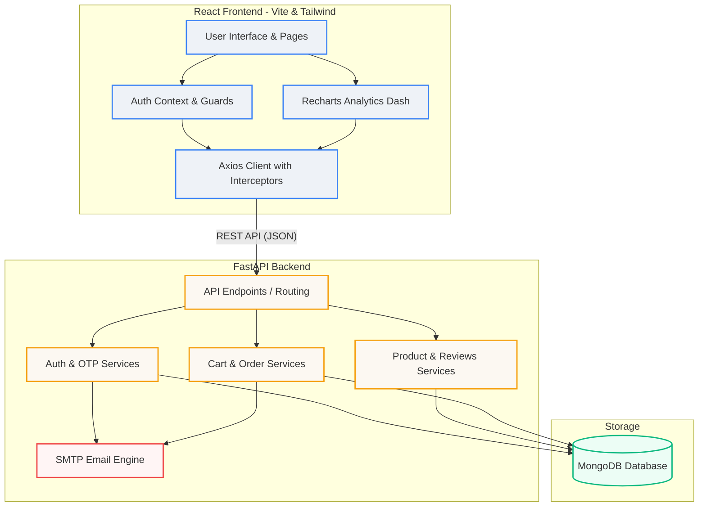

# IntelliCart

IntelliCart is a full-stack e-commerce demo application with a FastAPI backend, a React + Vite frontend, and standard MongoDB database integration. It is designed with premium aesthetics, rich micro-animations, and full-featured workflows for users and administrators.

## Project Structure

- `backend/` — FastAPI API server, MongoDB (Motor + Beanie) integration, authentication with JWT & OTP email verification, product reviews with verified purchase logic, cart management, checkout with programmatic stock rollback, analytics aggregation APIs, order tracking, and email logistics.
- `frontend/` — React/Vite app powered by Tailwind CSS, featuring product catalog filtering, interactive cart, coupon discounts, secure profile and address management (with auto-selecting new address flows), search & sort options, product reviews with ratings & verified badges, and a comprehensive admin panel with interactive Recharts analytics graphs.
- `docker-compose.yml` — Multi-container containerized stack orchestration for local development (FastAPI backend, React frontend, and MongoDB database).
- `nginx/` — Reverse-proxy configuration assets for unified routing (reserved).
- `ai-service/` — Directory reserved for optional machine learning and recommendations services.
- `DEV_MANUAL.md` — Detailed technical developer manual explaining page flows, authentication lifecycles, database migrations, and schema/service architectures.

---

## System Architecture



IntelliCart implements a clean 3-tier architecture:
1. **Client Tier:** React 18 frontend powered by Vite and Tailwind CSS. Employs `recharts` for interactive admin metrics and dashboards, and custom context state guards.
2. **Application Tier:** Python-based FastAPI server exposing standard REST routes protected by JWT authorization and admin roles.
3. **Data Tier:** MongoDB database coupled with Motor and the Beanie Object Document Mapper (ODM) for object models and transactional queries.

---

## Setup & Installation

### 1. Environment Configurations

#### Backend Environment Settings
Create a `.env` file in the `backend/` directory or root workspace:
```env
APP_NAME=IntelliCart
APP_VERSION=1.0.0
MONGODB_URL=mongodb://localhost:27017
DATABASE_NAME=intellicart
JWT_SECRET_KEY=your-jwt-secure-signing-key
JWT_ALGORITHM=HS256
ACCESS_TOKEN_EXPIRE_MINUTES=60

# SMTP Email Configurations (For OTP and Order Invoices)
SMTP_SERVER=smtp.gmail.com
SMTP_PORT=587
SMTP_USERNAME=your-smtp-email@gmail.com
SMTP_PASSWORD=your-smtp-app-password
SMTP_FROM_EMAIL=your-smtp-email@gmail.com
SMTP_FROM_NAME=IntelliCart
OTP_EXPIRY_MINUTES=10
```

#### Frontend Environment Settings
Create a `.env` file in the `frontend/` directory:
```env
VITE_API_URL=http://localhost:8000/api/v1
VITE_BACKEND_URL=http://localhost:8000
```

---

### 2. Running Locally

#### Backend Setup
Ensure you have MongoDB running locally, then:
```powershell
cd backend
python -m venv .venv
.\.venv\Scripts\Activate.ps1
pip install -r requirements.txt
uvicorn app.main:app --reload --port 8000
```

#### Frontend Setup
```bash
cd frontend
npm install
npm run dev
```
Open [http://localhost:5173](http://localhost:5173) in your browser.

---

### 3. Running with Docker Compose

To build and launch the containerized application stack (including a local MongoDB instance):
```bash
docker compose up --build
```
- **Frontend App:** [http://localhost:5173](http://localhost:5173) (User route redirects admins to `/admin`)
- **Backend API Docs:** [http://localhost:8000/docs](http://localhost:8000/docs) (Swagger interface)
- **MongoDB:** `mongodb://localhost:27017`

---

## Seed Accounts (Testing Credentials)

For fast testing of the application's functionality, the database is seeded automatically at startup:
- **Default Administrator Account:**
  - **Email:** `admin@intellicart.com`
  - **Password:** `admin123`
- **Default User Accounts:**
  - Feel free to register any email. Enter the 6-digit OTP code sent to your configured SMTP inbox to complete registration.

---

## Development Notes

- **API Base Route:** `/api/v1` served on `http://localhost:8000`.
- **Static Assets:** Product images are uploaded and served statically from `http://localhost:8000/uploads/products/`.
- **CORS Protection:** The FastAPI backend is configured to accept requests from the frontend client origin (`http://localhost:5173`).
- **Axios Interceptor:** Intercepts `401 Unauthorized` responses and fires global events to handle session expiration (logging users out and redirecting to login).
- **Programmatic Rollback:** Order checkouts verify product inventory and deduct stock atomically. If any item is out of stock, a programmatic rollback restores previously reserved inventory items.
- **Verified Purchase Reviews:** Submitting reviews requires checking order history. Validated purchases are marked on the database document and rendered with a badge in the UI. If a verified order is subsequently updated or cancelled, a synchronizer (`reverify_user_review_for_product`) updates review verification status.
- **Admin Dashboard Analytics:** Aggregates store performance data (revenue timeline, categories share, best sellers, funnel statistics) via MongoDB aggregation pipelines. Visualized using animated Recharts components.
